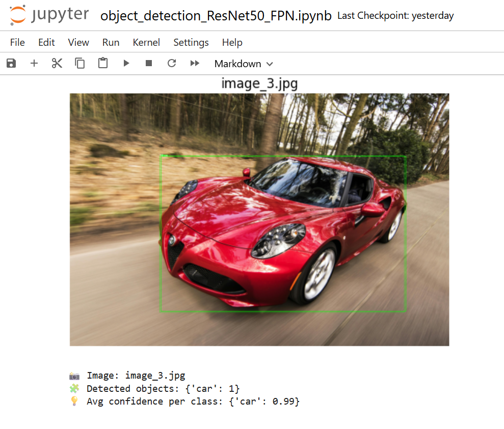

<h1 align="center">🚀 Object Detection with Faster R-CNN (ResNet50-FPN)</h1>

<p align="center">
  <strong>Real-Time Object Detection & Classification using Transfer Learning on Faster R-CNN with ResNet50-FPN Backbone</strong><br>
  <em>Implemented in PyTorch and Torchvision — trained, evaluated, and visualized in Jupyter Notebook</em>
</p>


<p align="center">
  
  
  
  
  
  
  
</p>

---


<h2 align="center">📚 Table of Contents</h2>

- 🚀 [Project Overview](#-project-overview)
- 🧩 [Model Architecture](#-model-architecture)
- 🧠 [Dataset & Training](#-dataset--training)
- 📈 [Results & Evaluation](#-results--evaluation)
- ⚙️ [Installation & Usage](#-installation--usage)
- 💼 [Libraries & Tools](#-libraries--tools)
- 🔮 [Future Improvements](#-future-improvements)
- 🙏 [Acknowledgements](#-acknowledgements)
- 🪪 [License](#-license)
- 🤝 [Contact](#-contact)


---

<h2 id="-project-overview" align="center">🧠 Project Overview</h2>

<p align="center">
  This project implements <b>Object Detection</b> using <b>Faster R-CNN with ResNet50-FPN</b>, a state-of-the-art deep learning model for real-time object localization and classification.  
  The model is fine-tuned on a custom dataset to accurately detect multiple object classes in images, combining <b>region proposal networks (RPN)</b> with a powerful <b>ResNet-50 Feature Pyramid Network</b>.
</p>

---

<h2 id="-model-architecture" align="center">🏗️ Model Architecture</h2>

- **Backbone:** ResNet-50 with Feature Pyramid Network (FPN)  
- **Detector Head:** Faster R-CNN  
- **Framework:** PyTorch + Torchvision  
- **Loss Function:** Classification + Bounding Box Regression  
- **Optimization:** SGD / Adam with learning rate scheduler  


---

<h2 id="-dataset--training" align="center">📦 Dataset & Training</h2>

- **Dataset:** Custom dataset prepared for object detection (COCO-style format)  
- **Classes:** Multiple object categories (e.g., car, laptop, person, bicycle, etc.)  
- **Input Size:** 224×224  
- **Data Split:** 80% training / 20% validation  
- **Epochs:** 10–15  
- **Batch Size:** 4  
- **Hardware:** CPU-compatible, GPU-accelerated optional  

Training Pipeline:
```python
from torchvision.models.detection import fasterrcnn_resnet50_fpn

model = fasterrcnn_resnet50_fpn(pretrained=True)
num_classes = len(dataset.classes)
in_features = model.roi_heads.box_predictor.cls_score.in_features
model.roi_heads.box_predictor = FastRCNNPredictor(in_features, num_classes)
```

<h2 id="-results--evaluation" align="center">📊 Results & Evaluation</h2>

<h3 align="center">📸 Visual Detection Results</h3>

<div align="center">
  <br><br>
  
</div>

<p align="center">
  Each bounding box highlights detected objects with class labels and confidence scores.<br>
  Visualizations generated directly from <code>object_detection_ResNet50_FPN.ipynb</code>.
</p>

<p align="center">
  
  
  
</p>

---

<h2 id="-installation--usage" align="center">⚙️ Installation & Usage</h2>

```bash
# Clone this repository
git clone https://github.com/hamaylzahid/object-detection-ResNet50-FPN.git
cd object-detection-ResNet50-FPN

# Install dependencies
pip install torch torchvision opencv-python matplotlib numpy

# Run the notebook
jupyter notebook object_detection_ResNet50_FPN.ipynb
 ```

<h2 id="-future-improvements" align="center">🚧 Future Improvements</h2>

- [ ] Convert model to ONNX or TorchScript for deployment  
- [ ] Integrate real-time video detection  
- [ ] Add custom UI for object annotation  
- [ ] Experiment with MobileNet-FPN for faster inference  

---

<h2 id="-acknowledgements" align="center">🙏 Acknowledgements</h2>

- PyTorch & Torchvision team for open-source detection models  
- COCO Dataset for reference annotation format  
- NVIDIA and Kaggle for providing GPU resources  

<h2 align="center">💼 Libraries & Tools</h2>

Object Detection using <b>Faster R-CNN (ResNet50-FPN)</b> is powered by a robust deep learning stack — optimized for precision, scalability, and research-ready deployment.

🧠 Every library here plays a vital role — from feature extraction and region proposal to visualization and performance tracking.  
🔗 Together, they enable an end-to-end detection pipeline that fuses computer vision and deep learning excellence.

---
<h3 align="center">🧩 Core Stack</h3>

<p align="center">
  
  
  
  
  
</p>

---

<h2 align="center">🤝 Contact & Contribution</h2>

<p align="center">
  <a href="mailto:maylzahid588@gmail.com">
    
  </a>
  <a href="https://linkedin.com/in/hamaylzahid">
    
  </a>
  <a href="https://github.com/hamaylzahid/object-detection-ResNet50-FPN">
    
  </a>
</p>

<p align="center">
  
  
</p>

⭐ **Found this project helpful?** Give it a star on GitHub!  
🤝 **Want to enhance it?** Fork the repo and submit a PR — your improvements are always welcome.

---

<h2 align="center">📜 License</h2>

<p align="center">
  
  
  
</p>

<p align="center">
  <sub><i>Empowering machines to see the world — one frame at a time.</i></sub>
</p>

<p align="center">
  🤖 <b>Use this project to explore your passion for computer vision & deep learning.</b><br>
  🧬 Clone it, modify it, expand it — and bring intelligent perception to life.
</p>


